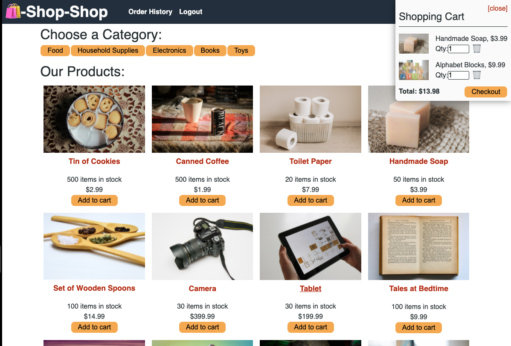

# Shop-Shop

An e-commerce platform built on React, Redux and GraphQL.

## Description

The [Shop-Shop](https://shop-shop-12hundred.herokuapp.com/) app is a sample e-commerce application built to demonstrate the MERN stack and the use of global state, using Redux.  Like a typical online store, it has a product list page, with a simple browse/filter-by category function, a product detail page, a shopping cart with checkout (with Stripe integrated for payment), and order history.

## Features
- Home/Category page: Upon arriving at the Shop Shop site, users are presented with a list of products, displayed in a grid, with category button display across the top. The category buttons can be used to filter the products by category. Products can be added directly to the cart from this view, or the user can click the product image or name to go to the Details page for the selected product.
- Details page: Display a larger image of the product along with a brief description. A product can be added to or removed from the cart from this page. "Add to Cart" will either add the item or increment its quantity in the cart, if it's already there.  "Remove from Cart" removes the item from the cart completely, regardless of the quantity.
- Cart: The shopping cart is displayed as a fly-out at the top right of the screen in desktop more, or in-line at the bottom of the screen on mobile devices. The Cart is revealed when an item is added to it, or when the user clicks the shopping cart icon. In the cart view, the user can update the quantity of items in the cart, delete them from the cart, or go to checkout.
- Checkout: Clicking "Checkout" in the cart takes the user to a checkout page hosted by Stripe, where they can enter payment info and complete their transaction. Completing the checkout process clears the cart and adds the order information to the user's Order History.
- Order History: The user's order history can be viewed by clicking the appropriate header navigation link. Orders are listed in reverse order by date.

## Implementation Notes
- The Shop Shop app functions as a single-page application (aside from the Stripe checkout page), using [React-Router](https://reactrouter.com/).
- State is maintained throughout the app in a [Redux](https://redux.js.org/) store.
- The server uses a [MongoDB](https://www.mongodb.com/) data store to store users, products, and categories.
- The server's GraphQL API is powered by [Apollo Server](https://www.apollographql.com/)

## Screenshot

## Links
- [GitHub](https://github.com/costanza13/shop-shop)
- [Shop-Shop](https://shop-shop-12hundred.herokuapp.com/)